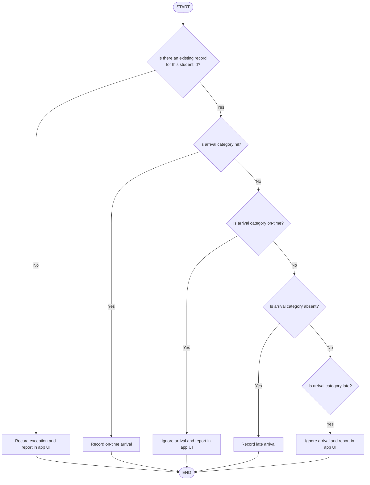
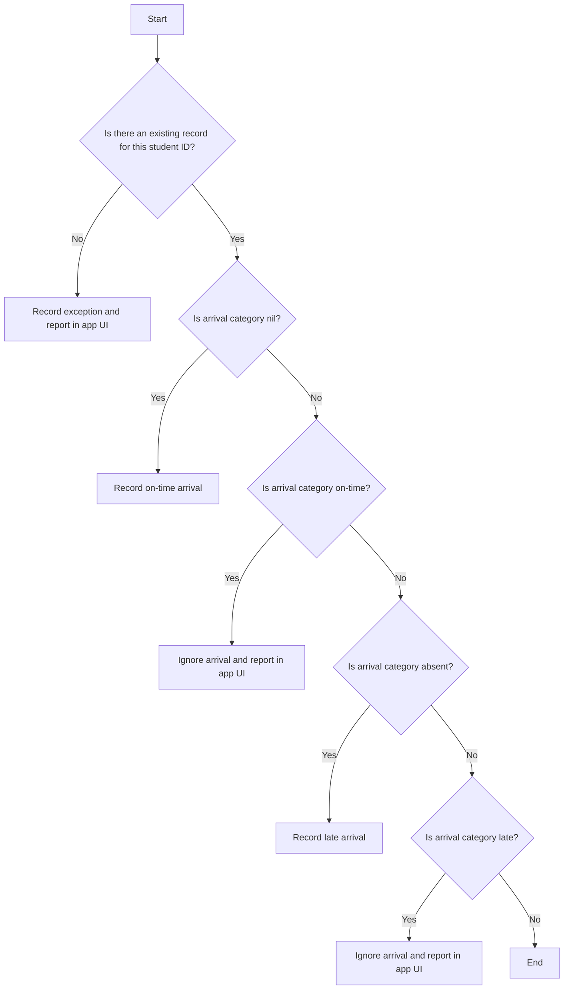

This page is a place to place text or other bits of information in, temporarily.

Here is when the SICs are available this week:

Day|Time|SIC|Location
-|-|-|-
Monday|1:00 PM to 1:30 PM|Nikita|Room 6
Friday|1:00 PM to 1:30 PM|Ben|Room 6

## SIC Drop-In Sessions

Here is this week's schedule:

Day|Time|SIC|Location
-|-|-|-
Monday, April 29|1:00 PM to 1:30 PM|Griffin|Room 36
Tuesday, April 30|12:30 PM to 1:30 PM|Morgan|Room 36
Thursday, May 2|12:30 PM to 1:30 PM|Justin|Room 36
Friday, May 3|12:30 PM to 1:30 PM|Quin|Room 36

## Grove Time

This week's schedule is:

Day|Time|Location
-|-|-
Thursday|12:30 PM to 1:00 PM|Room 36
Friday|12:30 PM to 2:00 PM|Room 36

Grove Time is a drop-in, no appointment needed.

If you have a question, **don't hesitate**, come on by!

### RSA Numbers

As a further recap – this problem involves the use of loops in addition to conditionals – try the [[rsa-numbers.pdf|following puzzle involving identifying RSA numbers]].

To do so, make a new macOS command line project named **RSANumbers**.

You can test the correctness of your solution [[test-plan-rsa-numbers.pdf|using this test plan]].