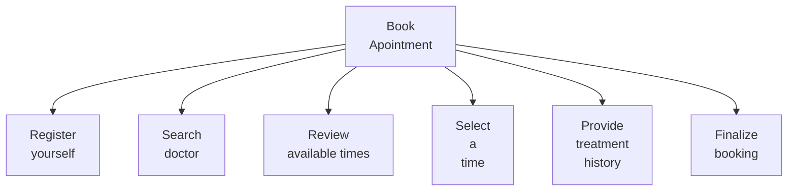
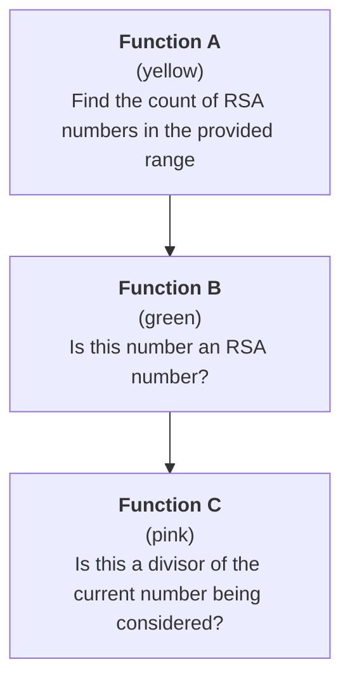

Functional decomposition refers to the process of considering a large problem, then breaking it down into smaller parts (decomposing it).

We can think of this as a top-down approach to identifying the smaller parts of a problem.

## How to start

Begin by writing a single sentence.

One problem to solve might be:

> Provide a patient with a way to make an appointment with a doctor.

For the [[rsa-numbers.pdf|RSA Numbers puzzle]], we could summarize the problem as:

> Find how many RSA numbers there are between the lower limit and upper limit provided.

## Decompose

For the first example, from the top (general problem) down (to the smaller problems) we might have:



Each step on the second level of the diagram represents a different function of the application we need to author.

With an unfamiliar problem, just doing a few examples by hand can be helpful. For the [[rsa-numbers.pdf|RSA Numbers puzzle]]:

![[Note Sep 18, 2024.png]]

From trying a few examples, we might realize there are three main functions, from most general, to most specific:



## Implementation

For the [[rsa-numbers.pdf|RSA Numbers puzzle]], we might then begin with these function shells, and then fill in the necessary logic:

Function A:

```swift
func findCountOfRSANumbers(between lower: Int, and upper: Int) -> Int {
	// Loop over numbers in range
	for i in lower...upper {
		// Check whether current number is an RSA number
		let result = isRSA(number: i)
		// Do something based on result...
	}
	// Return count of RSA numbers in the range given...
}
```

Function B:

```swift
func isRSA(number: Int) -> Bool {
	// Loop over possible divisors
	for j in 1...number {
		// Check whether current number is a divisor of this number
		let result = isDivisor(dividend: number, divisor: j)
		// Do something based on result...
	}
	// Return whether this number is an RSA number...
}
```

Function C:

```swift
func isDivisor(dividend: Int, divisor: Int) -> Bool {
	// Add logic to determine whether provided divisor actually
	// goes evenly into the provided dividend
	// (e.g.: remainder is zero) 

	// Return the result...
}
```