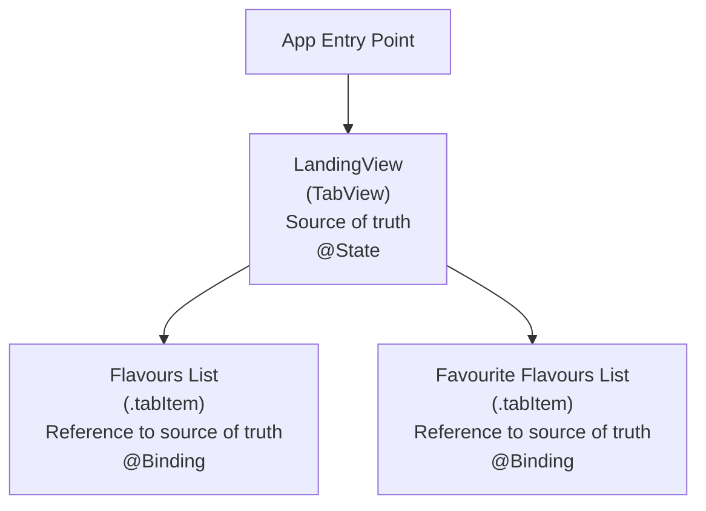

The purpose of this tutorial is to review how to share data within an app, from simple (just displaying information held in memory) to sophisticated (showing data stored in an online database).

Along the way, you will be reminded of an important concept when programming – the *scope* of a given property within a structure.

## Context

Imagine that you are a successful graduate of post-secondary studies: some or possibly a lot of which involved software engineering or computer science.

Your career is off to a smashing start, and accordingly you have been contracted by a well-known ice cream company to build an app that helps their customers keep track of their favourite flavours of ice cream.

## Displaying a list

You think back to your time at LCS, and remember Mr. Gordon, your old computer science teacher, telling you that:

> Nearly every app ever written for iOS will display data in a scrollable list at some point.

So, you begin with something simple – just displaying a list of ice cream flavours.

You author [a data model](https://raw.githubusercontent.com/lcs-rgordon/IceCreamFlavours/13cd3bec0ab43d87e8eb2c11a7731787af206e56/IceCreamFlavours/Model/IceCreamFlavour.swift) – you describe the data to be held in your app by creating a structure along with an array of instances of that structure:

![[Pasted image 20250112191044.png]]

Then you create your view that [displays the list of ice cream flavours](https://raw.githubusercontent.com/lcs-rgordon/IceCreamFlavours/13cd3bec0ab43d87e8eb2c11a7731787af206e56/IceCreamFlavours/Views/FlavoursListView.swift):

![[Pasted image 20250112191134.png]]

You now have a scrollable list of ice cream flavours, and this is a good start.

## Applying abstraction

Something niggles at the back of your mind, though. Mr. Gordon kept talking about *staying dry*. What was he on about, anyway? Didn't he own an umbrella?

Then you remember! It was an acronym:

> **D.R.Y.** or **D**on't **R**epeat **Y**ourself

You remember that Mr. Gordon meant: *apply abstraction* everywhere you can.

You look at the code in `FlavoursListView` and realize it could be more compact.

You extract the code shown here, that displays a flavour in the list:

![[Screenshot 2025-01-12 at 7.19.16 PM.png]]

... into it's [own helper view](https://raw.githubusercontent.com/lcs-rgordon/IceCreamFlavours/05ea5d88f0d0636e341d5a4e42b47b9fed112d6c/IceCreamFlavours/Views/FlavourListItemView.swift), like this:

![[Pasted image 20250112192338.png]]

... which you now use within your [scrollable list view](https://raw.githubusercontent.com/lcs-rgordon/IceCreamFlavours/05ea5d88f0d0636e341d5a4e42b47b9fed112d6c/IceCreamFlavours/Views/FlavoursListView.swift), like this:

![[Screenshot 2025-01-12 at 7.24.03 PM.png]]

And you remember – this is an example of how to pass information to a helper view when that information does not need to change.

You declared `flavourToShow` as a constant using the `let` keyword in the helper view:

![[Pasted image 20250112192623.png]]

Now `FlavourListItemView` has a stored property that must be populated when an instance of the view is created.

The stored property creates a *parameter* (a question) that must be provided with an *argument* (an answer).

For the purposes of previewing the helper view, that occurs here, on line 37, where the first element of the `flavours` array is passed in as an argument to the `flavourToShow` parameter:

![[Pasted image 20250112192818.png]]

In `FlavoursListView`, the `flavourToShow` parameter is populated with the `currentFlavour` argument:

![[Pasted image 20250112193122.png]]

`currentFlavour` in turn represents each flavour you originally included in your `flavours` array in the data model – the `List` structure in `FlavoursListView` iterates over the array, putting each element of the array into `currentFlavour`, one after the other:

![[Pasted image 20250112193158.png]]

## Showing favourites

You were contracted to build an app that lets users track their favourite ice cream flavours, so you make this modification to the `FlavourListItemView`, to show whether a given flavour is a favourite or not:

![[Pasted image 20250112193854.png]]

When `isFavourite` is `false`, the heart will be empty.

When `isFavourite` is `true`, the heart will be filled.

You make a [modification to your data model](https://raw.githubusercontent.com/lcs-rgordon/IceCreamFlavours/d5467d5955c44bbdac783eb85300c298fce225fc/IceCreamFlavours/Model/IceCreamFlavour.swift), so that the second item in the array is a favourite:

![[Pasted image 20250112194002.png]]

Then you add a second preview of `FlavourListItemView` so that you can be sure your code to display a different SF Symbol based on `isFavourite` is working:

![[Pasted image 20250112194101.png]]

[These changes](https://raw.githubusercontent.com/lcs-rgordon/IceCreamFlavours/d5467d5955c44bbdac783eb85300c298fce225fc/IceCreamFlavours/Views/FlavourListItemView.swift) look good, and then... another thing Mr. Gordon mentioned a lot comes to mind:

> Commit. Commit often. Commit like your life depends on it.

So, you commit your changes to your project using this message:

```
Made the list item view indicate whether a flavour is a favourite or not.
```

## Marking favourites

Now, you intend to make the heart act like a button, so that the user can click it, and toggle the favourite status on and off.

So, you add an `onTapGesture` closure to the `Image` structure, like this, and you are confronted with a problem:

![[Pasted image 20250112194626.png]]

Hmm... that's right, of course – a constant cannot be modified. So, you decide to try the **Fix** button, and you change the `flavourToShow` stored property from being declared as a constant to being declared as a variable:

![[Pasted image 20250112194808.png]]

Now you are momentarily confused – didn't you just define `flavourToShow` as a variable?

Then you remember... the `self` keyword means the `FlavourListItemView` structure! Structures in SwiftUI are immutable by default. This is how SwiftUI can draw many views very quickly – most everything is constant, or immutable, by default.

How do you fix your problem, though? You remember that *properties that will change* within a structure must be marked with the `@State` property wrapper. These properties are special – `FlavourListItemView` itself is immutable, except for properties that are marked with `@State`. You recall that SwiftUI knows the user interface needs to update when properties marked with `@State` are modified. 

However... you still feel a little deflated... because you remember this is a *helper view* and the ice cream flavour being displayed is being *passed into* this view.

You know that data created in SwiftUI apps must be initialized, or created, in one location only. There needs to be a *single source of truth*. So you cannot use the `@State` on the `flavourToShow` property in the helper view.

So, you go back to the `FlavoursListView` code, and review what you have:

![[Pasted image 20250112195429.png]]

You see that your scrollable list iterates over an array named `flavours` and you recall that you created this array in your data model:

![[Pasted image 20250112195458.png]]

You know that you cannot use the `@State` property wrapper in your data model. That property wrapper is only for use in a structure that is a view.

So, you return to `FlavoursListView` and add a new stored property:

![[Pasted image 20250112200102.png]]

You have initialized a new stored property named `flavoursList` by passing it the `flavours` array you created in your data model.

The single source of truth for your list of ice cream flavours in this app is on line 13. It is a variable array of ice cream flavours, marked with `@State`, so that when the data in the array changes, the user interface is updated.

You then modified the scrollable list, on line 20, to iterate over the new stored property:

![[Pasted image 20250112200231.png]]

And yet... you still have the same problem on `FlavoursListItemView`... you cannot toggle the boolean value in `flavourToShow`:

![[Pasted image 20250112200312.png]]

To resolve this, you remember that you need to *point back* to the source of truth. That is what a *binding* is for. So, you make this modification to your helper view:

![[Pasted image 20250112200451.png]]

On line 14, you have added the `@Binding` property wrapper to `flavourToShow`.

This resolves the error on line 36 – it is now possible to toggle the value of `isFavourite`.

You then temporarily comment out the previews in `FlavourListItemView`:

![[Screenshot 2025-01-12 at 8.20.01 PM.png]]

... and finally, you return to `FlavoursListView` and see one more error to resolve:

![[Screenshot 2025-01-12 at 8.23.48 PM.png]]

When you inspect the error:

![[Screenshot 2025-01-12 at 8.21.18 PM.png]]

... you realize that you just made the helper view require a binding. So, you must iterate over the array and create bindings to elements of the array defined on line 13:

![[Screenshot 2025-01-12 at 8.24.58 PM.png]]

Now, you can toggle favourites within your list, like so:

<div style="padding:56.25% 0 0 0;position:relative;">
	<iframe src="https://player.vimeo.com/video/1046263603?h=c655cbe90c&amp;badge=0&amp;autopause=0&amp;player_id=0&amp;app_id=58479&portrait=0&byline=0&title=0" frameborder="0" allow="autoplay; fullscreen; picture-in-picture; clipboard-write" style="position:absolute;top:0;left:0;width:100%;height:100%;" title="Opening the Teamspace">
	</iframe>
	</div>
<script src="https://player.vimeo.com/api/player.js"></script>

You figure this is a good time to commit, with the following message:

```
Made it possible to mark favourite flavours.
```

To recap, within a parent view, we mark the source of truth for a piece of data that will change with `@State`. When we want to *modify* that source of truth from a subview, we use the `@Binding` property wrapper:

![[Screenshot 2025-01-12 at 8.17.42 PM.png|300]]

Now, you remember the previews you commented out. You return to the helper view, and uncomment the previews:

![[Screenshot 2025-01-12 at 8.36.38 PM.png]]

You understand why you have errors showing. You are passing an immutable instance of the `IceCreamFlavour` structure into `FlavourListItemView` to show within the preview, when you know that `FlavourListItemView` expects a binding to a source of truth.

So, you adjust the previews as follows:

![[Pasted image 20250112200955.png]]

Breaking this down, within the scope of the first preview:

![[Screenshot 2025-01-12 at 8.10.22 PM.png]]

... on line 45, you have made a *local source of truth* just for this preview.

The stored property `flavour` is marked with `@State`, so the user interface will update when something about the flavour is changed within the preview.

In order to use a property like this within a preview, we must also mark the property with `@Previewable`.

A binding to this source of truth, `$flavour` is provided as an argument to the `flavourToShow` parameter in `FlavourListItemView`:

![[Screenshot 2025-01-12 at 8.14.00 PM.png]]

This is what allows us to create an interactive preview of this helper view:

<div style="padding:56.25% 0 0 0;position:relative;">
	<iframe src="https://player.vimeo.com/video/1046264907?h=772e42e863&amp;badge=0&amp;autopause=0&amp;player_id=0&amp;app_id=58479&portrait=0&byline=0&title=0" frameborder="0" allow="autoplay; fullscreen; picture-in-picture; clipboard-write" style="position:absolute;top:0;left:0;width:100%;height:100%;" title="Opening the Teamspace">
	</iframe>
	</div>
<script src="https://player.vimeo.com/api/player.js"></script>

You commit your changes with the message:

```
Made a local source of truth for each preview, to provide a live binding to the helper view.
```

## Showing only favourites

You realize that with so many flavours to choose from, it might be nice for the user to see only their favourite flavours on another tab within the app, like this:

![[Screenshot 2025-01-12 at 9.02.18 PM.png]]

... and this:

![[Screenshot 2025-01-12 at 9.02.44 PM.png]]

It *is* possible to do by moving the source of truth to a parent view that sits above the two list views, which in turns shares it's data with the two subviews using bindings:



However, you remember... way, way back... that when building the to-do list in the grade 11 computer science course, you learned about the MVVM design pattern.

Quoting from that tutorial:

> So, there is a *software design pattern* known as MVVM, which stands for **Model-View-ViewModel**.
> 
> Model and view code work exactly as you already understand them to.
> 
> When we introduce a **view model**, it takes over the job of managing the *state* of the data that is described by our model. The view model also manages the actual work of creating, reading, updating, or deleting data on behalf of views within an app.
> 
> A single view model might be used by many views within an app.
> 
> Visually, and in general, that looks like this: 
> ```mermaid
> flowchart LR
> 
> id1["<b>Model</b>\nDescribes data"] --> id2["<b>View Model</b>\nManages the state of data"]
> id2 --> id3["<b>View(s)</b>\nPresent data"]
> id3 --> id2
> 
> ```
> 
> If necessary, the view model creates an initial, empty instance of whatever data structures are described by the model. Or the view model might load existing instances of data (for example, from a database).
> 
> The view model provides instances of data to view(s) in an app. As needed, views call upon the view model to create, read, update, or delete data on their behalf.

It is much easier to use a view model to provide data to the two views we want to create in the ice cream app.

A view model is always defined as a class – so that when one view modifies information in the instance of that class – all views see the same data.

